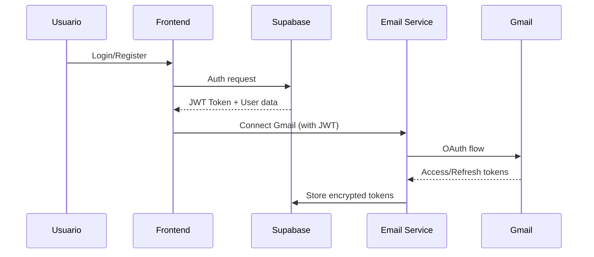
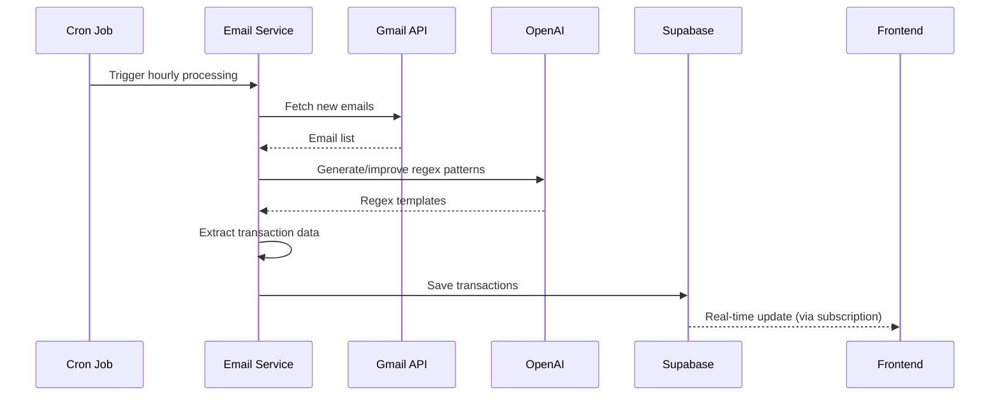
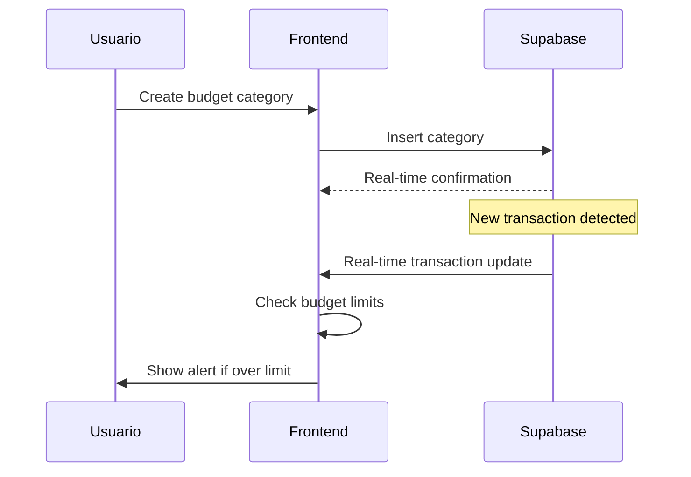

# 💰 AFP Finance App - Personal Finance with AI-Powered Email Analysis

Una aplicación de finanzas personales que revoluciona el manejo de presupuestos mediante la
detección automática de transacciones a través del análisis inteligente de emails bancarios.

## 🏗️ Arquitectura del Sistema

```
┌─────────────────┐    ┌──────────────────┐    ┌─────────────────────┐
│   Frontend      │    │    Supabase      │    │   Railway Service   │
│   (Railway)     │    │                  │    │   (Node.js + Redis) │
│                 │    │  • Auth          │    │                     │
│  • Vite + React│◄──►│  • PostgreSQL    │◄──►│  • Gmail API        │
│  • PWA          │    │  • Real-time     │    │  • OpenAI           │
│  • TypeScript   │    │  • Row Security  │    │  • BullMQ Jobs      │
└─────────────────┘    └──────────────────┘    └─────────────────────┘
```

## 📁 Estructura del Monorepo

```
AFP_V2/
├── README.md                         # Este archivo
├── .gitignore
├── .env.example
├── package.json                      # Scripts globales del workspace
├── pnpm-workspace.yaml              # Configuración del workspace
│
├── apps/
│   ├── web/                          # Frontend PWA (Deploy: Railway)
│   │   ├── package.json
│   │   ├── vite.config.ts
│   │   ├── railway.json
│   │   ├── index.html
│   │   ├── public/
│   │   │   ├── manifest.json
│   │   │   ├── pwa-192x192.png
│   │   │   └── pwa-512x512.png
│   │   └── src/
│   │       ├── main.tsx
│   │       ├── App.tsx
│   │       ├── components/
│   │       │   ├── Dashboard/
│   │       │   ├── Transactions/
│   │       │   ├── Budget/
│   │       │   ├── Settings/
│   │       │   └── Auth/
│   │       ├── hooks/
│   │       │   ├── useAuth.ts
│   │       │   ├── useTransactions.ts
│   │       │   ├── useBudget.ts
│   │       │   └── useOfflineSync.ts
│   │       ├── lib/
│   │       │   ├── supabase.ts
│   │       │   ├── pwa.ts
│   │       │   └── api.ts
│   │       ├── stores/
│   │       │   ├── authStore.ts
│   │       │   ├── transactionStore.ts
│   │       │   └── budgetStore.ts
│   │       ├── utils/
│   │       │   ├── formatters.ts
│   │       │   ├── validators.ts
│   │       │   └── constants.ts
│   │       └── types/
│   │           └── index.ts
│   │
│   └── email-service/                # Microservicio Node.js (Deploy: Railway)
│       ├── package.json
│       ├── railway.json
│       ├── tsconfig.json
│       ├── src/
│       │   ├── server.ts
│       │   ├── app.ts
│       │   ├── controllers/
│       │   │   ├── emailController.ts
│       │   │   ├── transactionController.ts
│       │   │   └── healthController.ts
│       │   ├── services/
│       │   │   ├── gmailService.ts
│       │   │   ├── aiService.ts
│       │   │   ├── transactionService.ts
│       │   │   └── supabaseService.ts
│       │   ├── jobs/
│       │   │   ├── emailProcessor.ts
│       │   │   ├── aiTraining.ts
│       │   │   └── scheduler.ts
│       │   ├── middleware/
│       │   │   ├── auth.ts
│       │   │   ├── validation.ts
│       │   │   └── errorHandler.ts
│       │   ├── utils/
│       │   │   ├── encryption.ts
│       │   │   ├── logger.ts
│       │   │   └── regex.ts
│       │   ├── config/
│       │   │   ├── database.ts
│       │   │   ├── gmail.ts
│       │   │   └── redis.ts
│       │   └── types/
│       │       └── index.ts
│       └── Dockerfile
│
├── packages/
│   ├── shared-types/                 # Types compartidos entre apps
│   │   ├── package.json
│   │   ├── tsconfig.json
│   │   └── src/
│   │       ├── database.ts
│   │       ├── api.ts
│   │       ├── transactions.ts
│   │       ├── budget.ts
│   │       └── index.ts
│   │
│   ├── ui-components/                # Componentes UI reutilizables
│   │   ├── package.json
│   │   ├── tsconfig.json
│   │   ├── tailwind.config.js
│   │   └── src/
│   │       ├── Button/
│   │       ├── Modal/
│   │       ├── Charts/
│   │       ├── Forms/
│   │       └── index.ts
│   │
│   └── supabase/                     # Configuración y schema de Supabase
│       ├── config.toml
│       ├── seed.sql
│       └── migrations/
│           ├── 20241001000001_initial_schema.sql
│           ├── 20241001000002_rls_policies.sql
│           └── 20241001000003_functions.sql
│
├── scripts/
│   ├── setup.sh                     # Setup inicial del proyecto
│   ├── dev.sh                       # Iniciar desarrollo local
│   ├── build.sh                     # Build de producción
│   ├── deploy.sh                    # Deploy a Railway
│   └── db-reset.sh                  # Reset de base de datos local
│
├── docs/
│   ├── api/
│   │   └── email-service.md
│   ├── deployment/
│   │   ├── railway.md
│   │   └── supabase.md
│   └── development/
│       ├── getting-started.md
│       └── contributing.md
│
└── tasks/                           # PRDs y documentación de tareas
    └── 0001-prd-personal-finance-app.md
```

## 🔄 Flujo de Datos y Procesos

### 1. **Flujo de Autenticación**



### 2. **Flujo de Procesamiento de Emails**



### 3. **Flujo de Gestión de Presupuesto**



## 🚀 Stack Tecnológico

### **Frontend (PWA)**

- **Build Tool:** Vite 4+ - Build rápido y HMR instantáneo
- **Framework:** React 18+ con TypeScript - Type safety y componentes modernos
- **PWA:** vite-plugin-pwa - Service worker automático y manifest
- **State:** Zustand - State management ligero y simple
- **Styling:** Tailwind CSS - Utility-first CSS framework
- **Charts:** Recharts - Gráficos financieros interactivos
- **HTTP:** Supabase client - Real-time y REST API

### **Backend (Microservicio)**

- **Runtime:** Node.js 18+ con TypeScript - Performance y type safety
- **Framework:** Fastify - HTTP server de alta performance
- **Jobs:** BullMQ + Redis - Background jobs y scheduling
- **Email:** googleapis - Integración nativa con Gmail
- **AI:** OpenAI SDK - Generación de regex patterns
- **Database:** Supabase client con service role - Bypass RLS
- **Validation:** Zod - Runtime type validation
- **Logging:** Winston - Structured logging

### **Infrastructure**

- **Deployment:** Railway - Platform-as-a-Service con CI/CD
- **Database:** Supabase PostgreSQL - Managed database con RLS
- **Cache/Queue:** Railway Redis - Para BullMQ jobs
- **Auth:** Supabase Auth - OAuth y JWT management
- **Monitoring:** Railway metrics + Winston logs

## 🛠️ Setup y Desarrollo

### **Prerrequisitos**

- Node.js 18+
- pnpm 8+
- Cuenta en Supabase
- Cuenta en Railway
- Cuenta en Google Cloud (para Gmail API)

### **Instalación**

```bash
# Clonar el repositorio
git clone <repo-url>
cd AFP_V2

# Instalar dependencias
pnpm install

# Configurar variables de entorno
cp .env.example .env
# Editar .env con tus credenciales

# Setup inicial
pnpm run setup

# Iniciar desarrollo
pnpm run dev
```

### **Scripts Disponibles**

```bash
# Desarrollo
pnpm run dev              # Inicia frontend y backend en modo desarrollo
pnpm run dev:web          # Solo frontend
pnpm run dev:api          # Solo backend

# Build
pnpm run build            # Build de producción para ambas apps
pnpm run build:web        # Build solo frontend
pnpm run build:api        # Build solo backend

# Testing
pnpm run test             # Tests de todas las apps
pnpm run test:web         # Tests del frontend
pnpm run test:api         # Tests del backend

# Database
pnpm run db:reset         # Reset database local
pnpm run db:migrate       # Ejecutar migraciones
pnpm run db:seed          # Seed data de desarrollo

# Deployment
pnpm run deploy           # Deploy a Railway
pnpm run deploy:web       # Deploy solo frontend
pnpm run deploy:api       # Deploy solo backend
```

## 🔐 Variables de Entorno

### **Frontend (.env)**

```bash
# Supabase
VITE_SUPABASE_URL=https://your-project.supabase.co
VITE_SUPABASE_ANON_KEY=your-anon-key

# Email Service
VITE_EMAIL_SERVICE_URL=https://your-service.up.railway.app

# App Config
VITE_APP_NAME="AFP Finance"
VITE_APP_VERSION="1.0.0"
```

### **Backend (.env)**

```bash
# Server
PORT=8080
NODE_ENV=development

# Supabase
SUPABASE_URL=https://your-project.supabase.co
SUPABASE_SERVICE_ROLE_KEY=your-service-role-key

# Gmail API
GMAIL_CLIENT_ID=your-gmail-client-id
GMAIL_CLIENT_SECRET=your-gmail-client-secret
GMAIL_REDIRECT_URI=http://localhost:8080/auth/gmail/callback

# OpenAI
OPENAI_API_KEY=your-openai-key

# Redis (Railway managed)
REDIS_URL=redis://localhost:6379

# Security
JWT_SECRET=your-jwt-secret
ENCRYPTION_KEY=your-32-char-encryption-key
```

## 📊 Características Principales

### **🤖 Detección Automática de Transacciones**

- Análisis de emails bancarios cada hora
- Regex patterns generados por AI
- Soporte para múltiples bancos y tarjetas
- Feedback loop para mejorar precisión

### **💰 Gestión de Presupuestos**

- Categorías personalizables
- Límites mensuales por categoría
- Alertas en tiempo real
- Reportes y análisis de tendencias

### **📱 Progressive Web App**

- Funciona offline
- Instalable en dispositivos móviles
- Push notifications para alertas
- Sync automático cuando vuelve online

### **🔒 Seguridad y Privacidad**

- Tokens de email encriptados
- No almacenamiento de emails raw
- Row Level Security en Supabase
- Comunicación HTTPS/TLS

## 🚀 Roadmap

### **Fase 1: MVP (Actual)**

- ✅ Autenticación con Supabase
- ✅ Conexión con Gmail
- ✅ Detección básica de transacciones
- ✅ Gestión de presupuestos
- ✅ PWA básica

### **Fase 2: Mejoras**

- 🔄 Múltiples proveedores de email
- 🔄 Categorización automática mejorada
- 🔄 Reportes avanzados
- 🔄 Exportación de datos

### **Fase 3: Expansión**

- 📋 Integración con APIs bancarias
- 📋 Soporte para múltiples monedas
- 📋 Cuentas familiares compartidas
- 📋 Integración con servicios de inversión

## 🤝 Contribución

1. Fork el proyecto
2. Crea una rama para tu feature (`git checkout -b feature/amazing-feature`)
3. Commit tus cambios (`git commit -m 'Add amazing feature'`)
4. Push a la rama (`git push origin feature/amazing-feature`)
5. Abre un Pull Request

## 📄 Licencia

Este proyecto está bajo la licencia MIT. Ver `LICENSE` para más detalles.

## 📞 Soporte

- 📧 Email: support@afp-finance.com
- 💬 Discord: [AFP Finance Community](https://discord.gg/afp-finance)
- 📚 Docs: [docs.afp-finance.com](https://docs.afp-finance.com)

---

**Hecho con ❤️ para revolucionar las finanzas personales**
# Railway deployment fix
